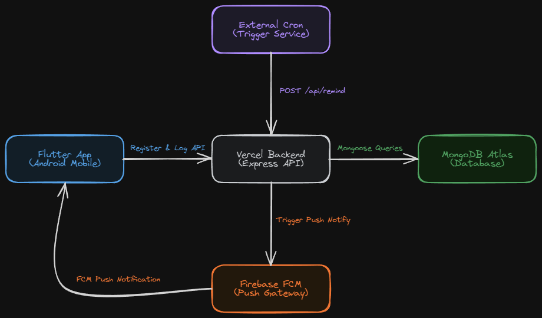

# Bloom


Android app that keeps you hydrated with a living flower that responds to your drinking habits. Miss a reminder and it wilts. Drink up and it thrives.

## Download

**[Download APK (ARM64)](https://github.com/Visalan-H/water-reminderr/releases/latest/download/app-arm64-v8a-release.apk)** — Install directly on Android (always the latest release)

> Requires Android 5.0+ · ~17 MB · No Play Store needed

## Features

- **Full-screen overlay reminders** — Appears over other apps, even on the lock screen
- **Living flower** — Custom-painted animated flower that droops when dehydrated and blooms when hydrated
- **Hydration tracking** — Percentage-based hydration level with smooth color transitions (red → amber → green)
- **Custom intervals** — 10m, 30m, 45m, 1h, 1.5h, 2h, 3h, 4h
- **Quiet hours** — Automatically pauses reminders from 10 PM – 6 AM
- **Backend-driven** — Firebase Cloud Messaging for reliable delivery even when the app is killed
- **Minimal footprint** — ~17 MB optimized APK

## How It Works

1. Open the app and work through the setup checklist (full-screen reminders, "Interrupt me anywhere", battery, background activity)
2. Pick your reminder interval and tap **Start**
3. The app registers with the backend via FCM
4. A cron job sends push notifications at your interval
5. The reminder takes over the screen — even while you're using the phone — tap **I drank water!** or **Let it wither**
6. Your flower reflects your hydration level in real time

## Flower States

| Level | State | Message |
|-------|-------|---------|
| 85-100% | Thriving! | Living my best life |
| 70-84% | Happy | Feeling fresh and fabulous~ |
| 55-69% | Content | Doing okay! A sip soon? |
| 40-54% | Thirsty | Could use some water |
| 25-39% | Wilting | Not doing so great... |
| 12-24% | Dying | I need water badly! |
| 0-11% | SOS | I'M LITERALLY DYING |

## Tech Stack

| Layer | Tech |
|-------|------|
| Frontend | Flutter (Dart), single-file app |
| Backend | Node.js + Express + Mongoose |
| Database | MongoDB Atlas |
| Push | Firebase Cloud Messaging (data-only messages) |
| Hosting | Vercel (serverless) |
| Cron | External cron service hitting `/api/remind` |

## Architecture



## Building From Source

### Prerequisites

- Flutter 3.0+
- Android SDK 21+
- Firebase project with Cloud Messaging enabled

### Setup

```bash
cd waterapp-frontend
flutter pub get
```

### Secrets

Secrets are injected at build time via `--dart-define` flags — **no secrets exist in source code**.

Create a `build-release.bat` (gitignored) with your secrets:

```bat
@echo off
set BACKEND_URL=https://your-backend.vercel.app
set REGISTER_SECRET=your_register_secret
set LOG_SECRET=your_log_secret

call flutter clean
call flutter pub get
call flutter build apk --release --split-per-abi ^
  --dart-define=BACKEND_URL=%BACKEND_URL% ^
  --dart-define=REGISTER_SECRET=%REGISTER_SECRET% ^
  --dart-define=LOG_SECRET=%LOG_SECRET%
```

### Backend Setup

The backend requires these environment variables (set in Vercel dashboard):

| Variable | Purpose |
|----------|---------|
| `MONGODB_URI` | MongoDB Atlas connection string |
| `FIREBASE_PROJECT_ID` | Firebase project ID |
| `FIREBASE_CLIENT_EMAIL` | Firebase service account email |
| `FIREBASE_PRIVATE_KEY` | Firebase service account private key |
| `CRON_SECRET` | Auth for `/api/remind` (header `x-secret`) |
| `REGISTER_SECRET` | Auth for `/api/register` |
| `LOG_SECRET` | Auth for `/api/log` |

### Permissions Required

- **Notifications** — Post reminder notifications
- **Full-screen reminders** — Show the reminder over the lock screen (Android 14+ requires granting this manually; the app walks you through it)
- **Interrupt me anywhere** ("Display over other apps") — Lets the reminder take over the screen even while you're actively using the phone, not just when it's locked
- **Battery unrestricted** — Prevent OS from killing the background handler
- **Background activity / Autostart** — Keep FCM handler alive (Xiaomi/MIUI in particular needs this enabled manually)

## License

[MIT](LICENSE)
